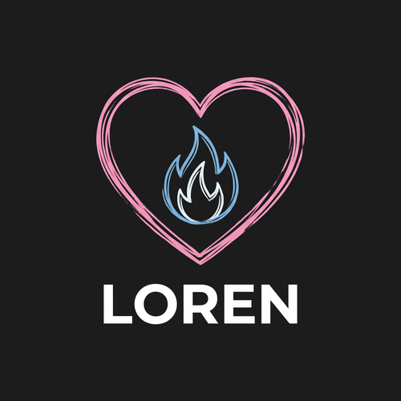

<p align="center">
  
</p>

<p align="center">
  <a href="https://fabideveloper.github.io/Loren-Framework/"><b>Docs</b></a> ·
  <a href="https://fabideveloper.github.io/Loren-Framework/docs/getting-started">Getting started</a> ·
  <a href="https://fabideveloper.github.io/Loren-Framework/docs/getting-started/upgrading">Upgrading from 1.5.1</a> ·
  <a href="https://www.npmjs.com/package/loren-framework">npm</a>
  <br><br>
  <a href="https://www.npmjs.com/package/loren-framework"></a>
  <a href="https://www.npmjs.com/package/loren-framework"></a>
  <a href="LICENSE"></a>
</p>

# Loren

Loren is a framework for Roblox games written in Luau. Server code goes in Services. Client code goes in
Controllers. Each module lists the modules it needs by name, and Loren loads them, sorts them and starts them
in order. When a Controller calls a Service, Loren carries the call and hands you a Promise. You don't create
RemoteEvents and you don't maintain require paths. A CLI sets up projects for Rojo, Argon or Studio's Script Sync.

> [!NOTE]
> **2.0 is in beta.** Install it with `npm i -g loren-framework@next`. Plain `npm i -g loren-framework`
> still gives you 1.5.1 until 2.0 is stable.

## What's new in 2.0

Most of 2.0 is in the parts you don't see. 1.5.1 trusted clients more than it should have. 2.0 checks every
packet before your code runs, drops junk without logging a line for each one, and tells you what went wrong
with an error code and an incident id.

We tested it in Roblox Studio. An exploiter bot fired 48,190 garbage packets, about 2,400 a second, while
honest players kept playing. Then we ran the same attack against 1.5.1.

| Same attack | 1.5.1 | 2.0 |
| :--- | :--- | :--- |
| Junk reaching your handlers | Crafted packets got through: 43 handler crashes | None. 0 of 48,190 accepted |
| Server warnings | 47,364, about 142k a minute | 0 |
| Server frame time | About 3x slower | Unchanged, p99 6.1 ms |
| Route ids | Stolen through the handshake RemoteFunction | No RemoteFunction to ask |
| Honest players' calls | 83% OK (the test ran above 1.5.1's 50 calls/s cap) | 1,206 of 1,206 OK |

Other numbers, all measured in Studio:

- Stress, 3 players at 60 calls a second each: 100% of calls OK, 0 lost or reordered signals.
- About 1.8 µs average handler cost. Round trip p50 about 15 ms, on one machine.
- Messages go out in batches, so a 64-byte call costs about 76 bytes (about 12 bytes of overhead).
- The check scenario passes with 1 and 3 players: 1,212 tests, 0 failed.

The CLI's own suite (141 tests, run with Node) passes too, real Rojo and Argon runs included.

New things you can use:

- `proxy.Try:Method()` for an `ok, result` answer without a Promise chain
- typed arguments with `Spec` and `T`
- `ClientEvents` for client-to-server events, reliable or unreliable
- `FireFor` and `FireExcept` on signals
- `LorenExtinguish`, a hook that runs when the server shuts down
- `Loren.Testing` for specs without a running server
- a "Did you mean" suggestion in the boot report when a `Dependencies` name has a typo

## Install and start

```bash
npm i -g loren-framework@next   # the 2.0 beta, needs Node 18 or newer
loren init my-game              # pick Rojo, Argon or None (Script Sync)
cd my-game
loren serve                     # then connect the Rojo or Argon plugin in Studio
```

For Rojo or Argon you also need [Rokit](https://github.com/rojo-rbx/rokit): `loren init` uses it to install the
tool. Script Sync needs nothing extra. Press Play. When the boot is done, Loren prints one `Burning on Server`
line. If something is wrong, you get one report that lists every problem.

Here's a Service and a Controller that talk to each other:

```lua
-- src/server/Services/PointsService.luau
local PointsService = { Client = {}, Signals = { "PointsChanged" } }
local points: { [Player]: number } = {}

function PointsService:AddPoints(player: Player, amount: number)
	points[player] = (points[player] or 0) + amount
	self.Signals.PointsChanged:Fire(player, points[player])
end

-- Clients can call this. Loren passes the calling player first, so nobody can pose as someone else.
function PointsService.Client:GetPoints(player: Player): number
	return points[player] or 0
end

return PointsService
```

```lua
-- src/client/Controllers/HudController.luau
local HudController = { Dependencies = { "PointsService" } }

-- LorenBurn runs once every module has started
function HudController:LorenBurn()
	local Points = self.Dependencies.PointsService
	Points.Signals.PointsChanged:Connect(function(total)
		print("Points:", total)
	end)
	local ok, total = Points.Try:GetPoints()
	if ok then print("Starting with", total) end
end

return HudController
```

## Upgrading from 1.5.1

```bash
npm i -g loren-framework@next
cd your-game
loren update --dry-run   # shows what it will change
loren update
```

Your Services and Controllers run unchanged. `loren update` replaces the runtime, backs up what it replaces to
`.loren-backup/`, and offers to rewrite colon-style middleware. Then press Play and read the boot report. The
[upgrade guide](https://fabideveloper.github.io/Loren-Framework/docs/getting-started/upgrading) lists every behavior change.

## Help and feedback

It's a beta, so try it on something you can afford to break. If something goes wrong,
[open an issue](https://github.com/fabideveloper/Loren-Framework/issues) and paste the boot report.
MIT licensed. Made by Fabi.
